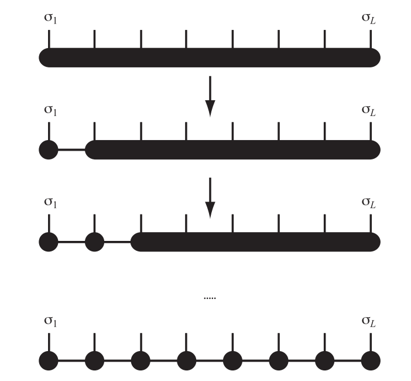

## Tensor-Based Simulation Methods for Quantum Many Body Systems

In this section, we will introduce some of the basic simulation methods for quantum many body systems, based on tensor network contractions. 
We will start by introducing the basic concepts of tensor networks, and then we will show how can that combine with Quantum many body systems, by introducing the Matrix Product States (MPS) [^MPS] and Matrix Product Operations (MPO) [^MPO]. 
Further, two important algorithms for simulating quantum many body systems will be introduced, including the Density Matrix Renormalization Group (DMRG) [^DMRG] [^Schollwöck] and the Time Dependent Variational Principle (TDVP) [^TDVP] [^Verstraete], which are used to search for the ground state and simulate the time evolution of quantum many body systems, respectively. 
As an end, a simple implementation based on `OMEinsum.jl` of these algorithms will be shown.

### Tensors and Tensor Networks

In the recent few decades, tensor networks (TNs) as a powerful tool have been widely used in various fields, include machine learning, quantum many body systems, and quantum information theory, etc, due to its ability to represent high-dimensional data and efficiently compute the contraction of high-dimensional tensors.

The basic elements of tensor networks are tensors, which are a multi-dimensional arrays.
A tensor $A$ with rank $d$ can be represented as $A_{i_1, i_2, \cdots, i_d}$, where $i_1, i_2, \cdots, i_d$ are the indices of the tensor $A$.
For example, a scalar is a rank zero tensor and a vector/matrix can be represented as a tensor with rank 1/2, respectively.
As shown in the following figure, we can represent the tensor $A$ as a circle with $d$ legs, where each leg corresponds to an index of the tensor.


Then by connecting the legs with shared indices of the tensors, we get a tensor network, so that we will be able to define the contraction on the tensor network, which is to sum over all the shared indices of the tensors, and the result is a new tensor.
A simple example is given in the following figure.


This contraction represents the multiplication of two matrices $A$ and $B$, and the result is a new matrix $C$, i.e.,
$$
C_{i, j} = \sum_{k} A_{i, k} B_{k, j} \;. 
$$

### Matrix Product States (MPS)

Matrix Product States (MPS) is a special form of tensor network, which is widely used to represent the wave function of 1D quantum many body systems.
Consider a 1D chain with $N$ sites, and each site has a local Hilbert space with dimension $d$.
Then to fully describe the quantum state of the system, we need a tensor with rank $N$, i.e., a tensor with $N$ legs and have a space complexity of $d^N$, and can be represented as:


which indicates that the space complexity of the tensor is exponential with respect to the system size, which is not practical for large systems.
Another way to represent the wave function is by a set of connect tensors, i.e., a tensor network, as shown in the following figure:


where the black circles represent the high dimensional matrices, the red lines represent the physical indices with dims $d$, and the black lines represent the bond indices with dims $D$. It is clear that if want to represent the wave function exactly, we still need exponential large bond dimensions. However, in many cases we are interested in, the entanglement of the quantum many body systems is limited, and it has been shown that in such cases the bond dimension can be a finite constant, which means that the quantum state of the system can be well approximated by a set low-rank tensors. The total space complexity of the MPS is $O(d D^2 N)$, which is linear to the system's size.

According to the low rank nature, we can reduce the large high-dims tensor to a MPS.
For example, if we have a 3 order tensor $T_{ijk}$, we can first merge two of the indices to form a matrix $M_{i,jk}$, and then apply the SVD to the matrix, so that
```math
  M_{i, jk} = U_{i,l} S_{l} V_{l, jk}^{\dagger} = U_{i,l} R_{l, jk},
```
so that the original huge tensor is split into two connected smaller tensors $U_{i,l}$ and $R_{l, jk}$.
Repeat this process, a large tensor can be represented as a product of smaller tensors, which is the MPS representation of the original tensor.



Furthermore, according to the SVD, we have 
```math
  U^{\dagger} U = I, V^{\dagger} V = I.
```
In this case, we will have two different gauge choices, by choosing $U$ or $V$ as the site tensors. The corresponding MPS representation are called **left-canonical** and **right-canonical** MPS, and of-cause you can have mixed-canonical MPS.

### Matrix Product Operators (MPO)

Similar to the MPS, the Matrix Product Operators (MPO) is a tensor network representation of a quantum operator. As introduced above, for a $N$ sites 1D string, a quantum operator is represented by a tensor with rank $2N$, which has a space complexity of $d^{2N}$, which is even larger than the MPS representation of the quantum state. Fortunately, most of the operations are local, and can be represented as a product of local tensors. One way to represent such a product is by a Matrix Product Operators (MPO), as shown in the following figure:

which can be applied on a MPS.

### Density Matrix Renormalization Group (DMRG)

Density Matrix Renormalization Group (DMRG) is a numerical method to find the ground state of a quantum many body system. The basic idea of DMRG is to find the ground state of a quantum many body system by iteratively optimizing the MPS representation of the quantum state. The optimization is done by minimizing the energy of the system, which is represented as a function of the MPS tensors. The optimization is done by a variational principle, and the energy is minimized by a set of linear equations, which can be solved by a set of linear algebra methods, such as the Lanczos algorithm.

Generally, the Hamiltonian of a quantum many body system can be represented as a tensor:

so that the group state problem can be represented as find the lowest eigenvalue of this linear equation:

Then by representing the Hamiltonian as a MPO,

we can start an iterative optimization process.

Generally speaking, in each step, the Hamiltonian is projected onto the subspace spanned by two neighboring sites, and then we can use the Lanczos algorithm to find the ground state of the projected Hamiltonian and optimize part of the MPS.

In the beginning, the process starts with a random MPS, and we first optimize the first two sites. Then projection Hamiltonian is represented as

and the projected quantum state is represented as

so that we can use Lanczos algorithm or other method to find the ground state in the project subspace.

In next step, we apply SVD to the optimized $B_{12}$ as

and merge the diagonal matrix into the next site tensor

so that we can optimize the next two sites.
Each step of this process can be represented as

In this way, finally we will get the ground state of the quantum many body system.

### Time Dependent Variational Principle (TDVP)

DMRG is a efficient method to find the ground state of a quantum many body system, however, it is not suitable for simulating the time evolution of a quantum many body system. For this purpose, the Time Dependent Variational Principle (TDVP) is proposed to simulate the time evolution.

Time evolution of a quantum state is governed by the Schrödinger equation:
$$
\frac{d}{dt} |\psi(t)\rangle = - i \hbar H |\psi(t)\rangle,
$$
which is a first order differential equation, and can be solved by a set of numerical methods, such as the Runge-Kutta method, etc. However, for a quantum many body system, the dimension of the Hilbert space is exponential with respect to the system size, and it is not practical to solve the Schrödinger equation directly.

The basic idea of TDVP is to simulate the time evolution of a quantum many body system by optimizing the MPS representation of the quantum state. The optimization is done by minimizing the distance between the quantum state at time $t$ and the quantum state at time $t + \delta t$, which is represented as a function of the MPS tensors. The optimization is done by a variational principle, and the distance is minimized by a set of linear equations, which are almost the same as the DMRG algorithm.

Here we will introduce the simple case, where we update only one site of the MPS, $A$, in each iteration, and the time evolution operator:
$$
\frac{d}{dt} |\psi(A)\rangle = - i \hat{P}_{T(A)} H |\psi(t)\rangle,
$$
where $\hat{P}$ is the tangent space projector, and $T(A)$ is the tangent space of the MPS at site $A$, and the projector can be given by
$$
\hat{P}_{T} = \sum_{j = 1}^N P^{L}_{j - 1} \otimes \hat{1}_j \otimes P^{R}_{j + 1} - \sum_{j = 1}^{N - 1} P^{L}_{j} \otimes P^{R}_{j + 1},
$$
In language of MPS, the left or right projector can be represented as

which is the same as that of the DMRG algorithm.

Then projected states are represented as

and

corresponding to the first and the second term of the projector.

Then in TDVP, we apply these two terms iteratively to get the projected Hamiltonian and the projected quantum state, and then we can evolve the quantum state to the next time step.

### References

[^MPS]: https://tensornetwork.org/mps/index.html#component

[^MPO]: https://tensornetwork.org/mpo/

[^DMRG]: https://tensornetwork.org/mps/algorithms/dmrg/

[^TDVP]: https://tensornetwork.org/mps/algorithms/timeevo/tdvp.html

[^Schollwöck]: U. Schollwöck, The density-matrix renormalization group in the age of matrix product states, Annals of Physics 326, 96-192 (2011)

[^Verstraete]: Verstraete, F., Nishino, T., Schollwöck, U. et al. Density matrix renormalization group, 30 years on. Nat Rev Phys 5, 273–276 (2023). https://doi.org/10.1038/s42254-023-00572-5