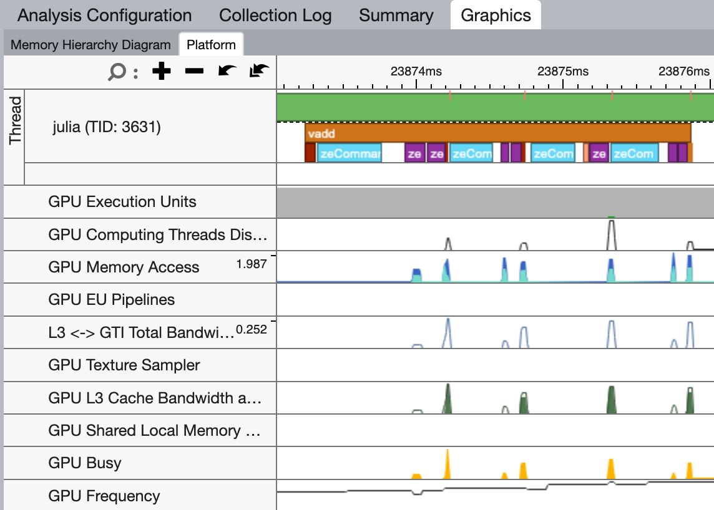
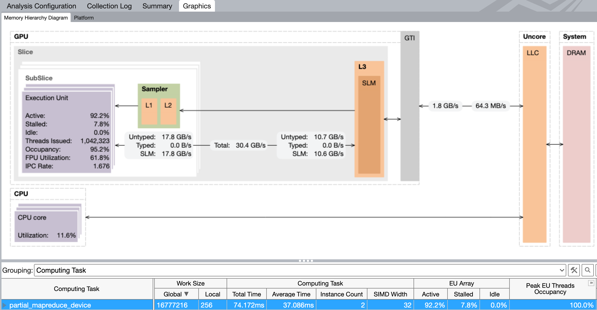

+++
title = "Profiling oneAPI.jl applications with VTune"
author = "Tim Besard"
abstract = """
  Profiling GPU applications is hard, so this post shows how to use Intel's
  VTune Profiler to profile GPU applications written in Julia with oneAPI.jl."""
+++

{{abstract}}

Because of the asynchronous nature of GPU execution, profiling GPU applications
with Julia's tried and tested tools like `@profile` or even `@time` can be
misleading: They will only show the time spent on the CPU, and will likely
report that your application is spending most of its time waiting for the GPU.

To get a better understanding of what is happening on the GPU, we need
specialized tools. In this post, we'll show how to use Intel's VTune Profiler to
profile GPU applications written in Julia using oneAPI.jl.


## Set-up

Start by downloading and installing the [Intel VTune
Profiler](https://www.intel.com/content/www/us/en/developer/tools/oneapi/vtune-profiler-download.html).
This does not require administrative permissions, and will install in your home
folder under the `intel` directory. On Linux, binaries will appear in
`~/intel/oneapi/vtune/latest/bin64`. There are three that are particularly
important:

- `vtune`: a command-line tool to profile applications;
- `vtune-gui`: a graphical user interface to profile applications, or to
  visualize the results of a command-line profiling session;
- `vtune-backend`: a daemon that creates a web interface for VTune, which you
  can use to profile applications both locally and remotely.


## Hello VTune!

Let's start with a simple example: A Julia program that computes the sum of two
arrays (i.e., the [`vadd`
example](https://github.com/JuliaGPU/oneAPI.jl/blob/master/examples/vadd.jl)
from the oneAPI repository):

```julia
using oneAPI

function kernel(a, b, c)
    i = get_global_id()
    @inbounds c[i] = a[i] + b[i]
    return
end

function vadd(a, b)
    d_a = oneArray(a)
    d_b = oneArray(b)
    d_c = similar(d_a)

    @oneapi items=size(d_c) kernel(d_a, d_b, d_c)
    Array(d_c)
end

function main(N=256)
    a = round.(rand(Float32, N) * 100)
    b = round.(rand(Float32, N) * 100)
    c = vadd(a, b)
end
main()
```

We've tweaked this example to make it more suited for profiling: We've enclosed
the main application in a function for performance improvement, and we've
increased the array sizes to make the GPU work harder.

There are several ways to profile this application. We'll start by demonstrating
the command-line interface:

```
$ vtune -collect gpu-offload julia vadd.jl

vtune: Collection started.
vtune: Collection stopped.

vtune: Using result path `/home/tim/Julia/pkg/oneAPI/r000gh'
    GPU Time: 0.002s
EU Array Stalled/Idle: 100.0% of Elapsed time with GPU busy
 | The percentage of time when the EUs were stalled or idle is high, which has a
 | negative impact on compute-bound applications.
FPU Utilization: 0.0% of Elapsed time with GPU busy
...
```

This will run the application, and collect a number of GPU-related metrics. A
summary is shown in the terminal, and a more detailed report will be written
to a directory in the current working directory. You can open that report with
the graphical user interface, possibly even on a different machine:

```
$ vtune-gui r000gh
```


## Instrumenting the application

The trace we just collected includes the time spent compiling our application,
making it difficult to analyze what is happening. To refine the trace, we can
instrument our application with Intel's Instrumentation and Tracing Technology
(ITT) APIs:

- only start the profiler when we're running code of interest;
- add markers to the trace to indicate what is happening.

We can interface with the ITT APIs using the IntelITT.jl package. Let's update
our example:

```julia
using oneAPI, IntelITT

# ...

function main(N=256)
    a = round.(rand(Float32, N) * 100)
    b = round.(rand(Float32, N) * 100)
    c = IntelITT.@range "vadd" oneAPI.@sync vadd(a, b)
end

# warm-up
main()

# actual profile
IntelITT.@profile main()
```

Here, the `IntelITT.@profile` macro will start and stop the profiler, so we
should launch VTune with the `-start-paused` option:

```
$ vtune -collect gpu-offload -start-paused julia vadd.jl
```

In the GUI, we can now clearly see a nicely packed stream of API calls, grouped
under the `vadd` range we added. Note that because API calls are asynchronous,
i.e. they return immediately before the GPU has executed them, I grouped them
under a `oneAPI.@sync` call so that the range not only captures the time spent
on the CPU, but also the time spent on the GPU. This may not be wanted for your
application.




## Kernel details

The timeline view is great for getting an application-level overview of what is
happening, but once you've isolated a kernel that doesn't perform as expected,
you may want to switch from the GPU Offload to the GPU Compute Hotspots
analysis. Here, you get a more detailed view of what's happening during
execution on the GPU, including the memory bandwidth and execution properties:



Many of these analysis can be configured to collect more or less data, at the
cost of more or less overhead.


## Working remotely

In many cases, your local system will not have a GPU, and you will want to
profile an application running on a remote system. As shown above, you can
use the `vtune` CLI to create a trace and open that locally using `vtune-gui`,
however there is an easier way: The `vtune-backend` daemon.

Start by launching the VTune back-end on the remote system:

```
$ vtune-backend --enable-server-profiling --web-port 8443 --log-to-console"
```

If your remote system is directly reachable, you want to add
`--allow-remote-access --base-url "https://remoteServer:8443`. However,
most people will need to set-up an SSH tunnel:

```
$ ssh -L 8443:localhost:8443 remoteServer
```

You can now access the VTune GUI at `https://localhost:8443/`. Note that the
first time you connect, you will need to do so using the one-time URL that is
shown in the terminal where you launched the `vtune-backend` daemon.

The web interface that `vtune-backend` provides is identical to the GUI from
`vtune-gui`: Start by creating a new project, and configuring an analysis:
Select the local VTune profile server, enter the path to the Julia executable
along with arguments and a working directory, and select the GPU Offload
analysis type:


To start the analysis, click the big blue play button. If you use
`IntelITT.@profile` to restrict the trace to the code of interest, use the
second button with the pause symbol.


## Give it a try!

Hopefully, this guide has shed some light on how to accurately profile oneAPI.jl
applications using Intel's VTune Profiler. It turns out that one package could
significantly benefit from some rigorous profiling: oneAPI.jl! Until now,
development has focussed on correctness and usability, leaving considerable room
for performance enhancements.

If you have access to an Intel GPU and want to gain experience profiling GPU
applications with VTune, we encourage you to get involved! A good starting point
would be analyzing some of oneAPI.jl's array operations like `mapreduce` or
`broadcast` to identify potential bottlenecks. For more information or any
queries, feel free to open an issue on GitHub, or join the discussion on Slack
or Discourse. Your input could make a significant difference!
